# Manual de usuario de crmbas

crmbas es el CRM con el que se gestiona la actividad comercial y el servicio
técnico de un negocio de equipamiento informático en España: desde el primer
contacto con un cliente hasta la garantía del equipo que se le vendió.

Las imágenes de este manual están tomadas de la aplicación con los datos de
demostración que trae la instalación: dos clientes, dos oportunidades, dos
presupuestos, dos incidencias y dos solicitudes de derechos.

---

## Índice

1. [Acceder](#1-acceder)
2. [La pantalla de inicio](#2-la-pantalla-de-inicio)
3. [Clientes y contactos](#3-clientes-y-contactos)
4. [Oportunidades](#4-oportunidades)
5. [El embudo](#5-el-embudo)
6. [Presupuestos](#6-presupuestos)
7. [Catálogo](#7-catálogo)
8. [Incidencias y RMA](#8-incidencias-y-rma)
9. [Protección de datos](#9-protección-de-datos)
10. [Auditoría](#10-auditoría)
11. [Correo automatizado](#11-correo-automatizado)
12. [Usuarios y permisos](#12-usuarios-y-permisos)
13. [Ajustes](#13-ajustes)
14. [Páginas públicas](#14-páginas-públicas)
15. [En el móvil y en tema oscuro](#15-en-el-móvil-y-en-tema-oscuro)
16. [Preguntas frecuentes](#16-preguntas-frecuentes)

---

## 1. Acceder

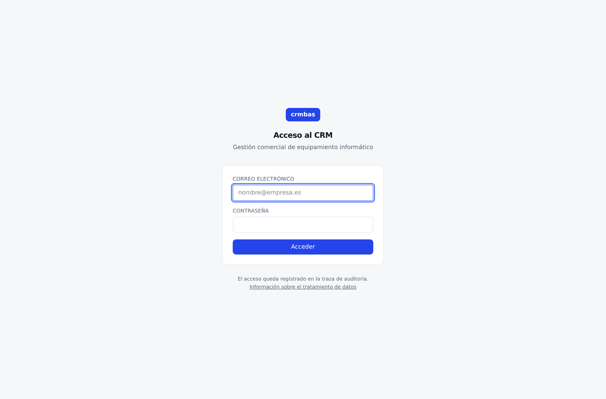

Introduce tu correo y tu contraseña. Si intentas abrir una dirección del CRM sin
haber iniciado sesión, la aplicación te lleva aquí y, una vez dentro, te devuelve
a donde ibas.

Si las credenciales no son correctas verás siempre el mismo mensaje, sin
distinguir entre «este usuario no existe» y «la contraseña no es esa». Es
deliberado: distinguirlos permitiría averiguar qué cuentas existen en el sistema.

Todo acceso queda registrado en la traza de auditoría.

### Qué puede hacer cada rol

| Rol | Alcance |
|---|---|
| **Administración** | Todo, incluidos usuarios, catálogo, auditoría y resolución de solicitudes de derechos. |
| **Comercial** | Clientes, contactos, oportunidades, presupuestos e incidencias. |
| **Soporte técnico** | Incidencias y RMA; consulta del resto de módulos. |
| **Solo lectura** | Consulta, sin modificar nada. |

Las opciones que tu rol no permite ni siquiera aparecen en el menú. Y aunque
alguien llegara a la dirección directamente, la base de datos tampoco le
devolvería los datos: el permiso se comprueba ahí, no solo en la pantalla.

---

## 2. La pantalla de inicio

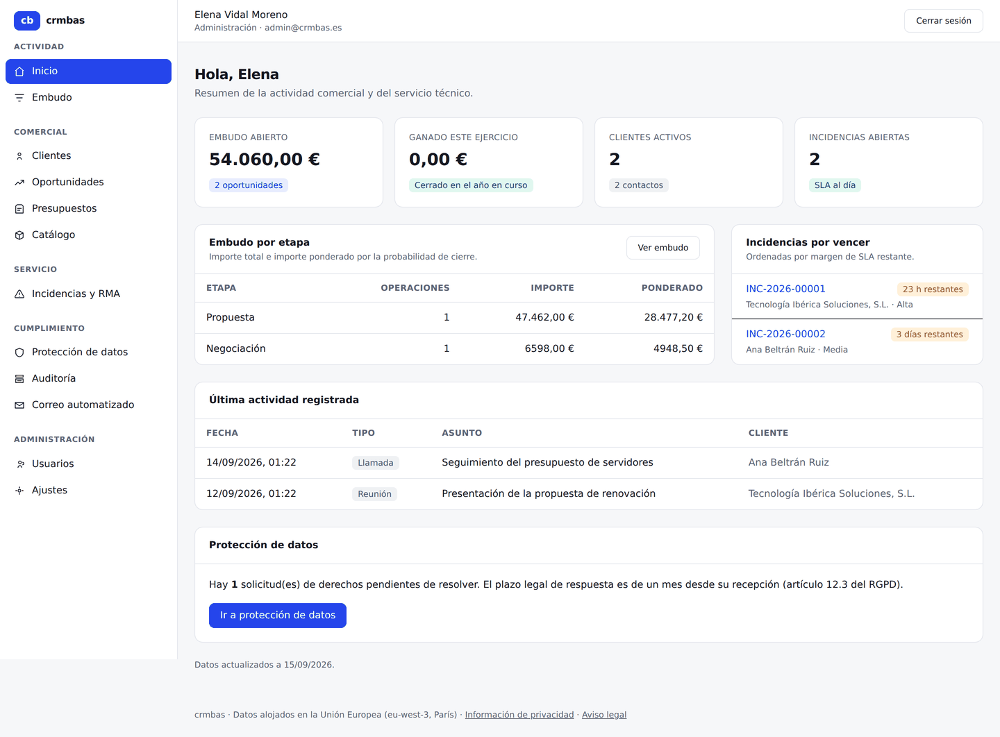

De un vistazo:

- **Embudo abierto** — lo que hay en juego ahora mismo, sin contar lo ya cerrado.
- **Ganado este ejercicio** — importe de las oportunidades ganadas en el año en curso.
- **Clientes activos** y sus personas de contacto.
- **Incidencias abiertas**, con aviso en rojo si alguna ha superado su compromiso
  de servicio.

Debajo, el embudo por etapa con el importe total y el **ponderado** (el importe
multiplicado por la probabilidad de cierre, que es la cifra que sirve para
previsiones), las incidencias ordenadas por margen de SLA restante y la última
actividad registrada por el equipo.

Si hay solicitudes de derechos pendientes, aparece un aviso al pie con el
recordatorio del plazo legal.

---

## 3. Clientes y contactos

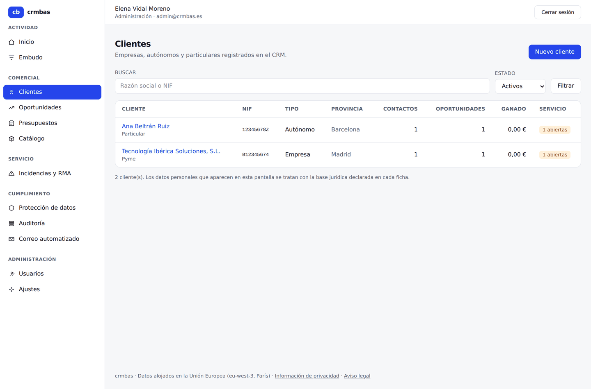

El listado muestra empresas, autónomos y particulares. Puedes buscar por razón
social o por NIF y filtrar por estado.

### Ficha de cliente

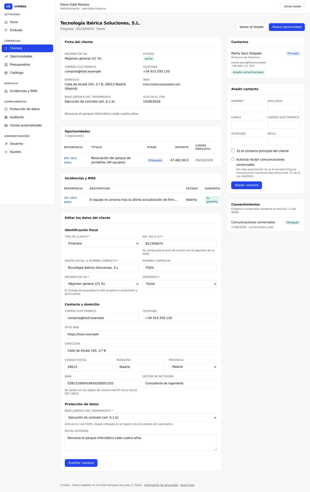

Reúne todo lo relacionado con ese cliente: sus datos fiscales, sus personas de
contacto, sus oportunidades, sus incidencias y sus consentimientos.

Desde aquí se añaden contactos y se editan los datos del cliente sin cambiar de
pantalla.

### Dar de alta un cliente

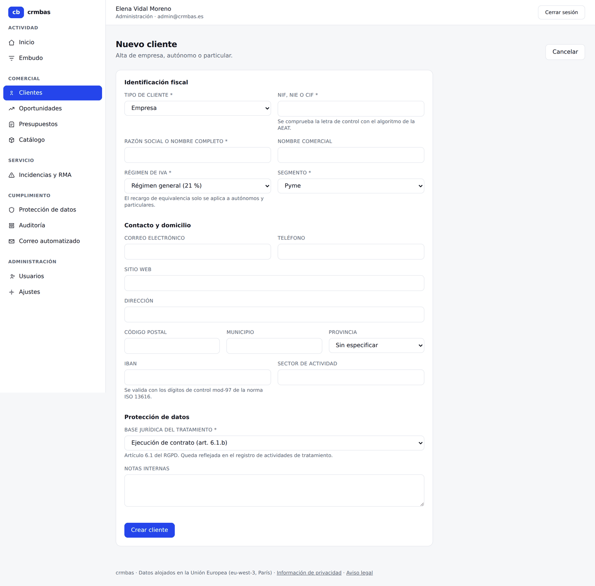

El formulario está dividido en tres bloques:

**Identificación fiscal.** El NIF se comprueba con el algoritmo oficial de la
AEAT, así que un documento mal tecleado no llega a guardarse. Vale igual para NIF
de persona física, NIE y NIF de entidad.

El **régimen de IVA** determina cómo se calculan después los presupuestos de este
cliente. El recargo de equivalencia solo puede asignarse a autónomos y
particulares: es un régimen de comerciantes minoristas personas físicas, y el
sistema no deja asignárselo a una sociedad.

**Contacto y domicilio.** El código postal se valida contra el rango de
provincias del INE y el IBAN contra sus dígitos de control.

**Protección de datos.** Aquí se declara la base jurídica por la que tratas los
datos de este cliente. En una relación comercial normal es *Ejecución de
contrato*. Este dato no es decorativo: aparece en el registro de actividades de
tratamiento que hay que poder enseñar si la Agencia Española de Protección de
Datos lo pide.

### Contactos y comunicaciones comerciales

Al añadir una persona de contacto hay una casilla para indicar si autoriza
recibir comunicaciones comerciales. **Si no está marcada, el sistema no le
enviará ninguna**, ni siquiera de forma automática. Lo exige el artículo 21 de la
Ley 34/2002.

---

## 4. Oportunidades

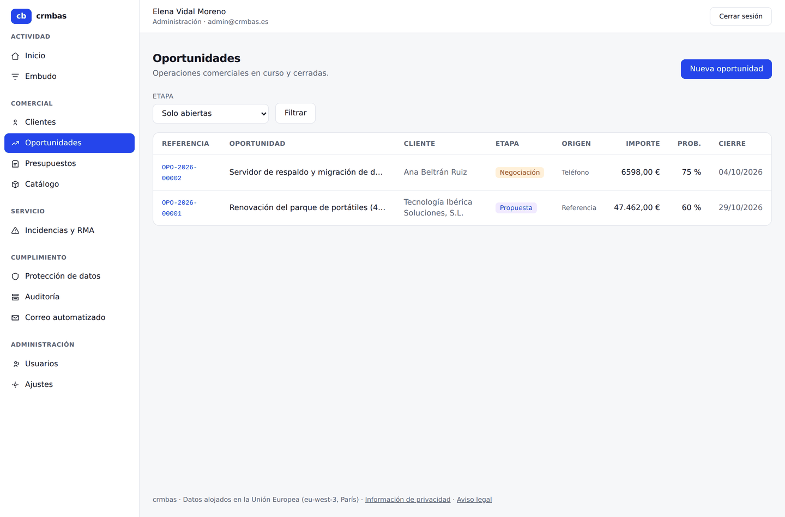

Cada operación comercial en curso es una oportunidad, con su referencia propia
(`OPO-año-número`), su importe estimado y su probabilidad de cierre.

### Ficha de oportunidad

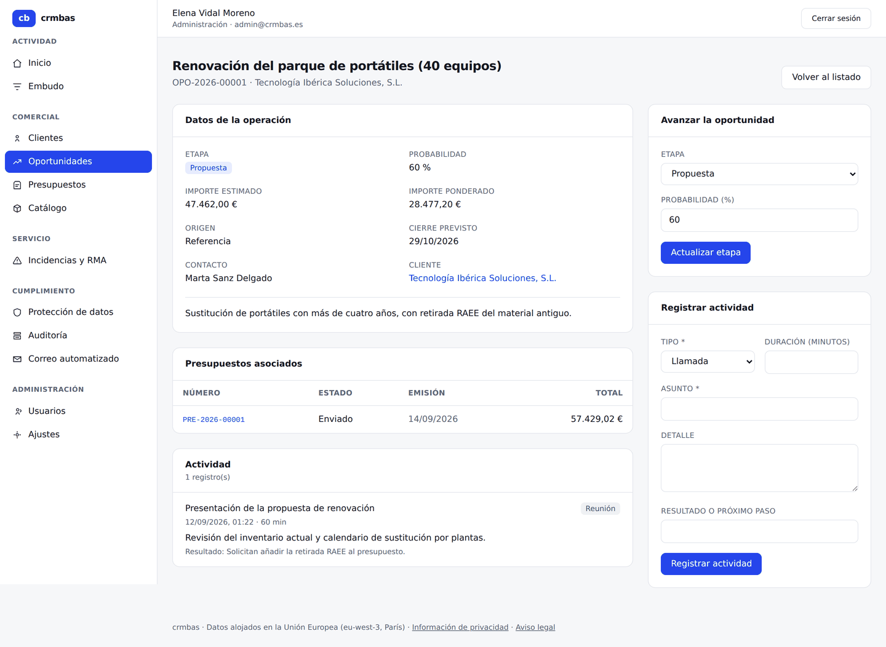

A la izquierda, los datos de la operación, los presupuestos que se han emitido y
el historial de actividad. A la derecha, las dos cosas que se hacen a diario:

**Avanzar la oportunidad.** Al cambiar de etapa se propone automáticamente la
probabilidad habitual de esa etapa, que puedes ajustar. Si la marcas como
*perdida*, el sistema exige el motivo: es la información que después permite
saber por qué se pierden operaciones.

Si la marcas como *ganada* y el contacto tiene correo, se le envía
automáticamente la confirmación.

**Registrar actividad.** Cada llamada, reunión o visita, con su duración y su
resultado. Es lo que permite que otra persona retome la operación sin tener que
preguntar por dónde iba.

### Crear una oportunidad

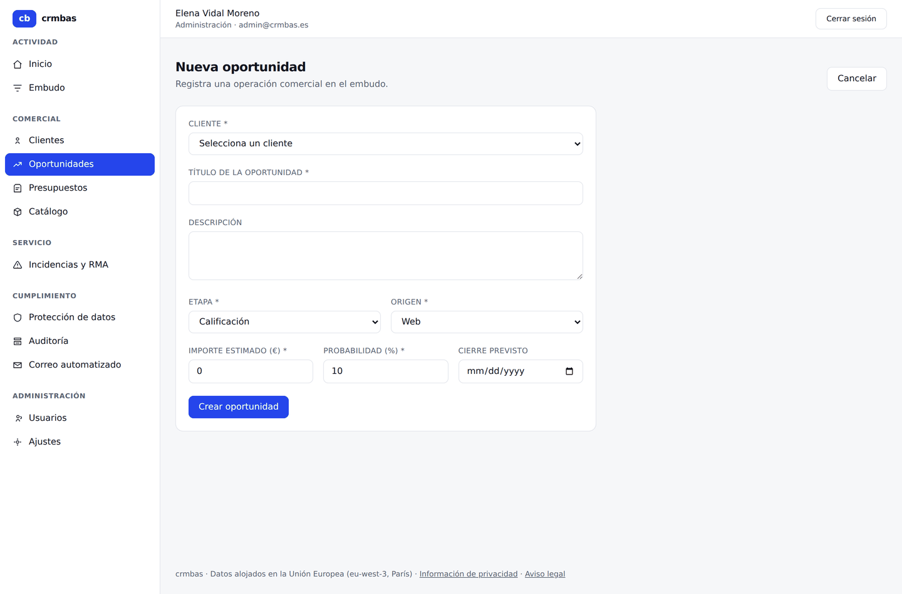

Al crearla solo se ofrecen las cuatro etapas abiertas: una oportunidad nace en
curso, no ganada ni perdida.

---

## 5. El embudo

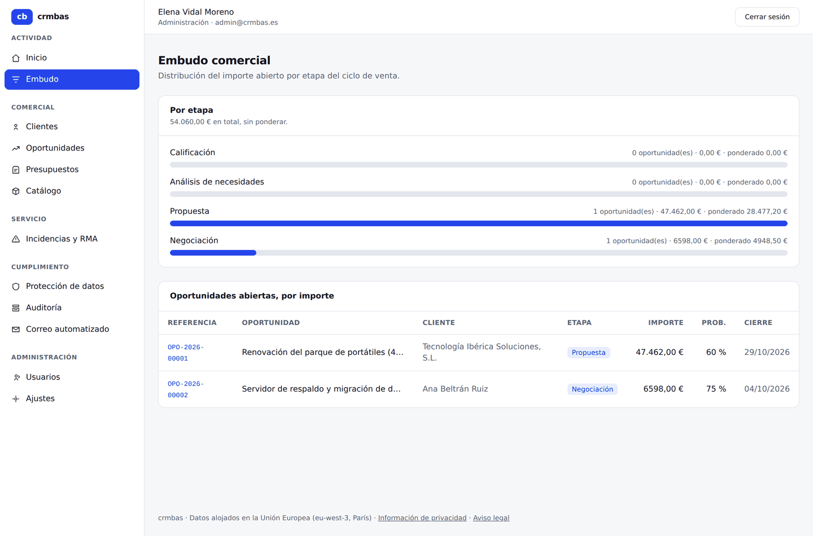

La misma información que en el inicio, pero con el detalle de cada etapa y el
listado completo ordenado por importe.

La barra de cada etapa es proporcional a su importe, lo que hace visible de un
golpe si la cartera está concentrada en una sola operación grande o repartida.

---

## 6. Presupuestos

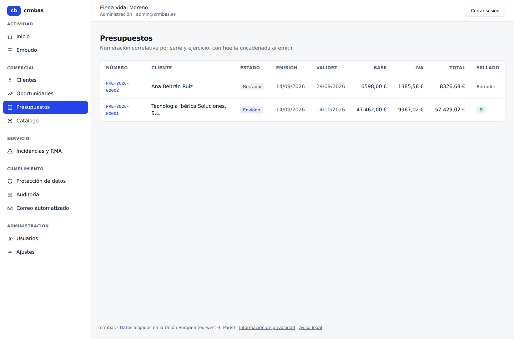

Los presupuestos se numeran de forma **correlativa y sin huecos** dentro de cada
serie y ejercicio (`PRE-2026-00001`, `PRE-2026-00002`…). Aunque dos personas
creen un presupuesto en el mismo instante, ninguna obtiene un número repetido y
no queda ningún número sin usar.

### Un presupuesto emitido

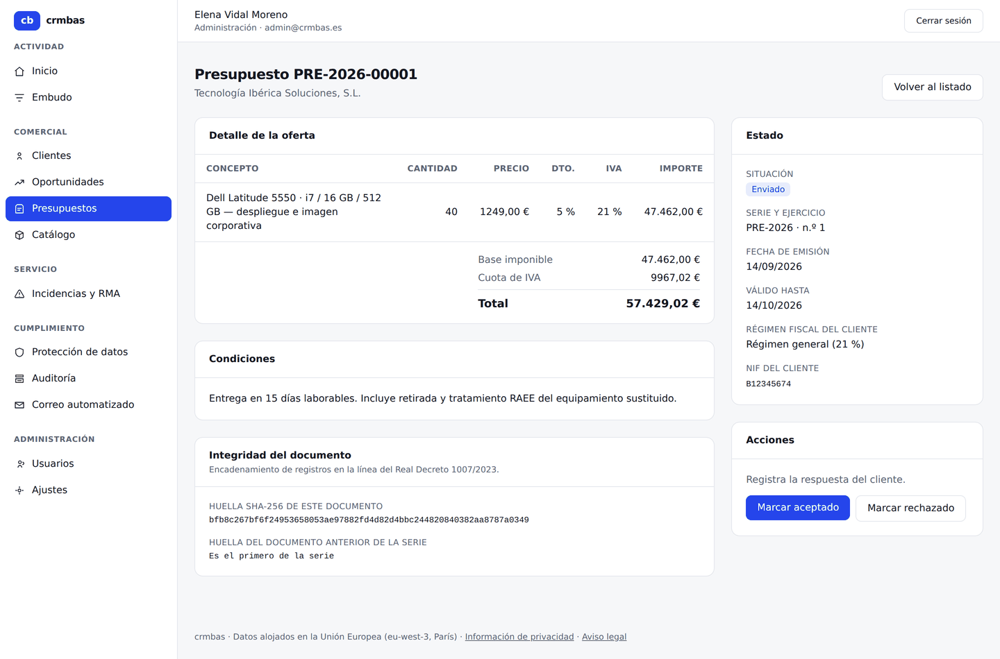

Los importes se calculan solos a partir de las líneas y del régimen fiscal del
cliente. Base imponible, cuota de IVA y total no se teclean nunca.

Al pie, **Integridad del documento**: cuando un presupuesto se emite se calcula
su huella SHA-256 y se encadena con la del documento anterior de la serie. Si
alguien modificara o borrara un presupuesto ya emitido, la cadena de todos los
posteriores dejaría de cuadrar y el cambio quedaría en evidencia. Es el mismo
principio que exige el reglamento Veri*factu (Real Decreto 1007/2023).

### Un presupuesto en borrador

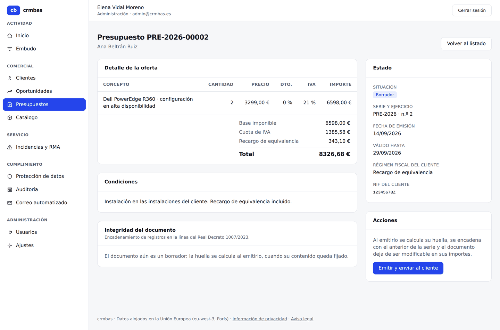

Mientras es borrador, el documento se puede cambiar y todavía no tiene huella:
se sella al emitirlo, que es cuando su contenido queda fijado y se comunica al
cliente.

Fíjate en este presupuesto: el cliente está acogido al **recargo de
equivalencia**, así que aparece una línea adicional con el 5,2 % sobre la base.
El sistema lo aplica solo porque lo dice la ficha del cliente.

Una vez aceptado o rechazado, el presupuesto ya no se retoca: queda como
evidencia de la oferta que se comunicó.

---

## 7. Catálogo

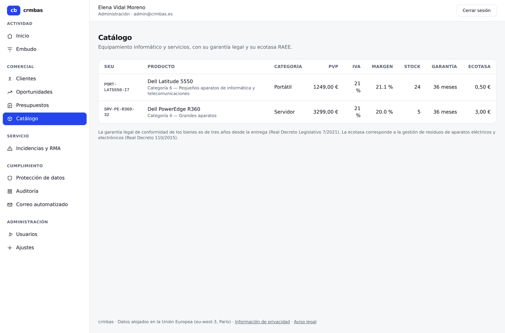

El catálogo de equipamiento y servicios, con su PVP, su IVA, su margen y su
stock. Cuando el stock baja del mínimo, la cifra aparece marcada en ámbar.

Dos columnas específicas del sector:

- **Garantía.** La garantía legal de conformidad en España es de **tres años**
  desde la entrega (Real Decreto Legislativo 7/2021). El sistema no admite menos
  de 36 meses salvo en software y servicios.
- **Ecotasa.** El importe de gestión de residuos de aparatos eléctricos y
  electrónicos, con su categoría RAEE (Real Decreto 110/2015).

El catálogo solo lo modifica administración: los precios no se cambian desde una
oportunidad.

---

## 8. Incidencias y RMA

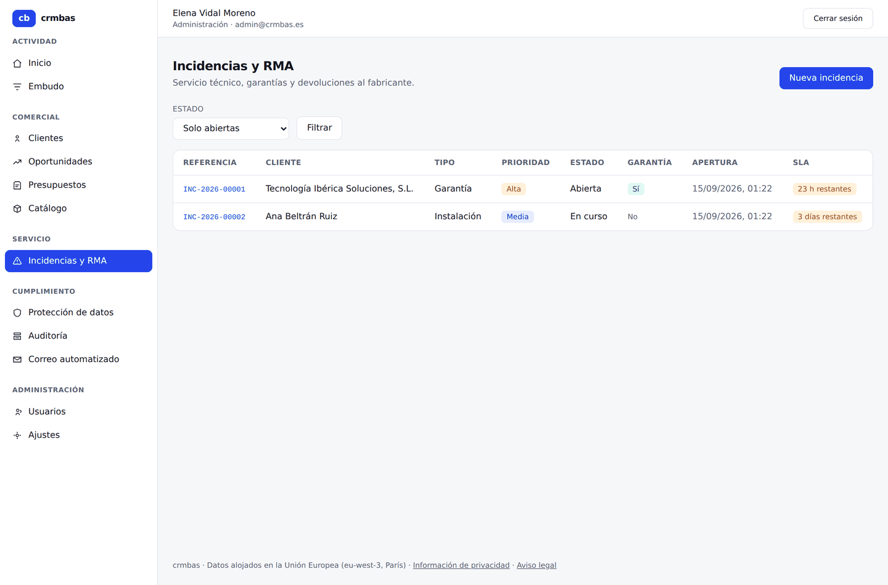

Averías, garantías, devoluciones al fabricante, instalaciones y mantenimiento.
Cada incidencia tiene su compromiso de servicio en horas, y la columna **SLA**
muestra el margen restante — en ámbar mientras queda tiempo, en rojo cuando ha
vencido.

### Ficha de incidencia

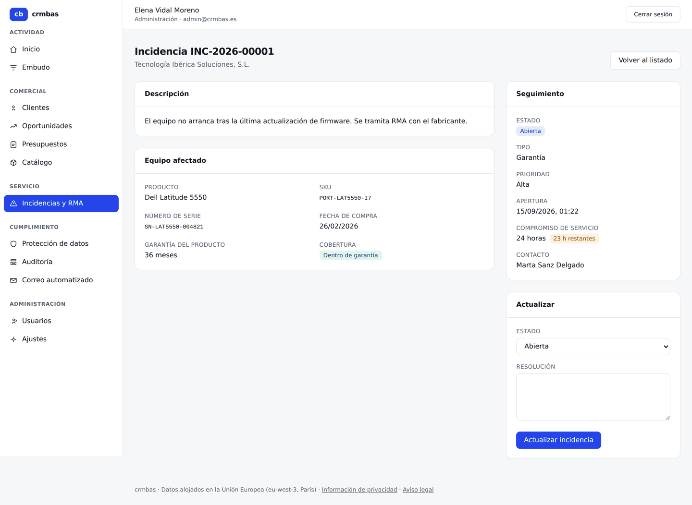

Recoge la descripción del problema, el equipo afectado con su número de serie y
su fecha de compra, y si está dentro del periodo de garantía.

Para pasar una incidencia a *resuelta* o *cerrada* hay que describir la
resolución. No es un capricho: sin esa descripción, la próxima vez que el mismo
equipo falle nadie sabrá qué se hizo. Al marcarla como resuelta se avisa
automáticamente al contacto.

### Abrir una incidencia

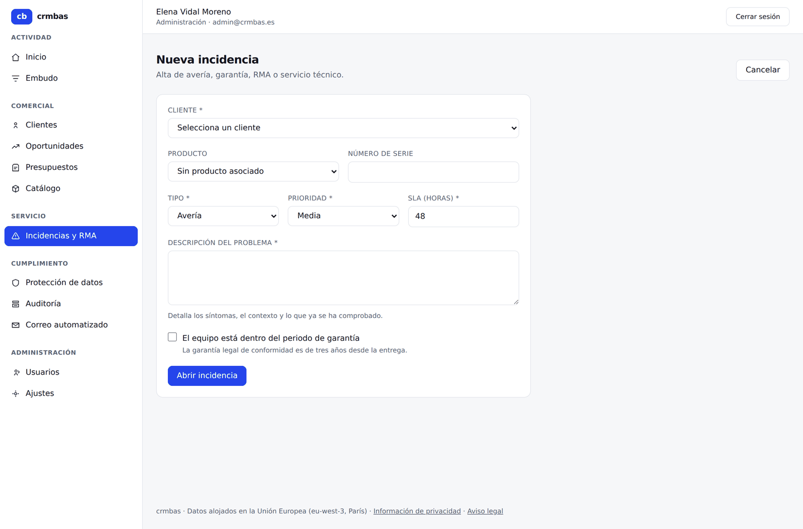

Al abrirla se envía el acuse de recibo al contacto con la referencia asignada.

---

## 9. Protección de datos

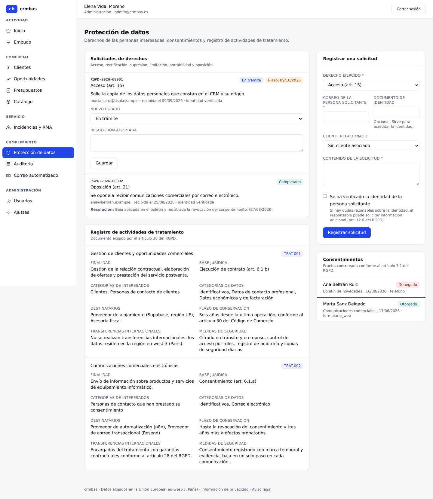

Esta pantalla existe porque el RGPD impone obligaciones concretas con plazos
concretos, y cumplirlas «de memoria» no funciona.

### Solicitudes de derechos

Cuando una persona ejerce cualquiera de sus derechos —acceso, rectificación,
supresión, limitación, portabilidad u oposición—, se registra aquí. El sistema
calcula solo la **fecha límite**: un mes desde la recepción, como fija el
artículo 12.3 del RGPD. Si el plazo se supera, la solicitud aparece destacada en
rojo y salta un aviso en la parte superior.

Al registrarla se envía automáticamente el acuse de recibo a la persona
solicitante, informándole de la fecha en que tendrá respuesta.

La casilla de identidad verificada recuerda algo que se olvida a menudo: si hay
dudas razonables sobre quién solicita, el responsable puede pedir información
adicional antes de entregar nada.

Solo administración resuelve solicitudes.

### Registro de actividades de tratamiento

El documento que exige el artículo 30 del RGPD, vivo dentro de la aplicación en
lugar de en un archivo que nadie actualiza: para qué se tratan los datos, con qué
base jurídica, de quién, qué categorías, a quién se comunican, cuánto se
conservan y con qué medidas de seguridad.

### Consentimientos

Cada consentimiento se conserva con su finalidad concreta, el canal por el que se
obtuvo, el texto exacto que se mostró y su marca temporal. Revocar no borra la
evidencia: añade la fecha de revocación. Es lo que permite demostrar tanto que
hubo consentimiento como que se respetó su retirada.

---

## 10. Auditoría

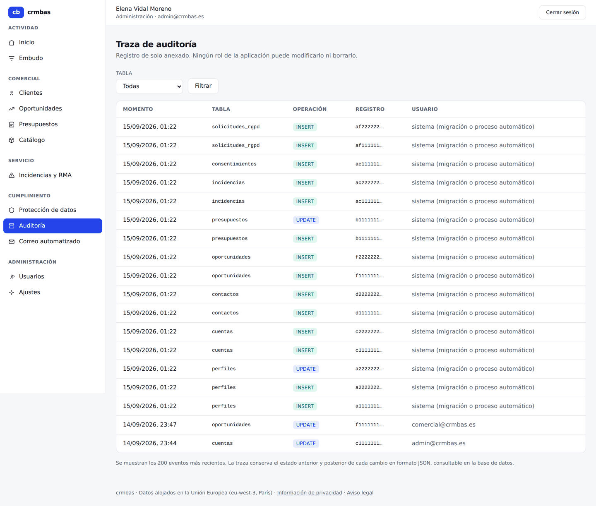

Toda operación sobre datos personales o económicos deja rastro: qué tabla, qué
operación, qué registro, quién y cuándo. La traza conserva además el estado
anterior y posterior de cada cambio.

Es un registro **de solo anexado**: ni siquiera administración puede modificarlo
o borrarlo desde la aplicación. Esa es justamente la propiedad que lo hace útil
como prueba.

Solo administración puede consultarlo.

---

## 11. Correo automatizado

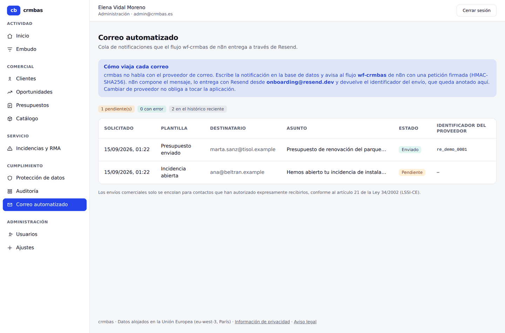

crmbas no envía el correo por sí mismo. Deja la notificación en una cola y avisa
al flujo **wf-crmbas**, que es quien la entrega a través de Resend y devuelve el
identificador del envío, que queda anotado aquí.

Esta pantalla muestra qué se ha enviado, a quién, cuándo y con qué resultado.
Cuando un cliente dice que no ha recibido algo, el identificador del proveedor es
lo que permite rastrear el envío.

Si un correo falla, el flujo lo reintenta hasta tres veces. Y si el aviso se
pierde por un corte de red, la revisión periódica de la cola lo recoge de todos
modos: ninguna notificación se queda olvidada.

Los correos comerciales solo se encolan para contactos que lo han autorizado.

---

## 12. Usuarios y permisos

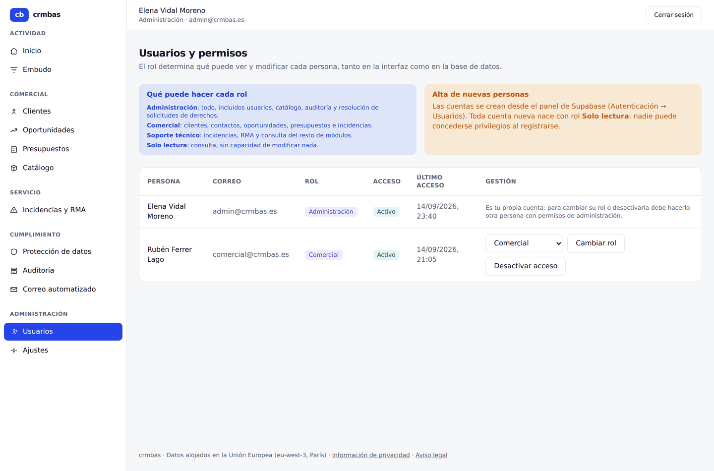

Desde aquí se cambia el rol de cada persona y se activa o desactiva su acceso.

Dos reglas que no se pueden saltar:

- **Toda cuenta nueva nace en solo lectura.** Nadie se concede privilegios al
  registrarse; alguien con permisos de administración tiene que elevarlos.
- **Nadie puede cambiar su propio rol ni desactivarse a sí mismo.** Tiene que
  hacerlo otra persona.

Las cuentas se crean desde el panel de Supabase; aquí se gobiernan sus permisos.

---

## 13. Ajustes

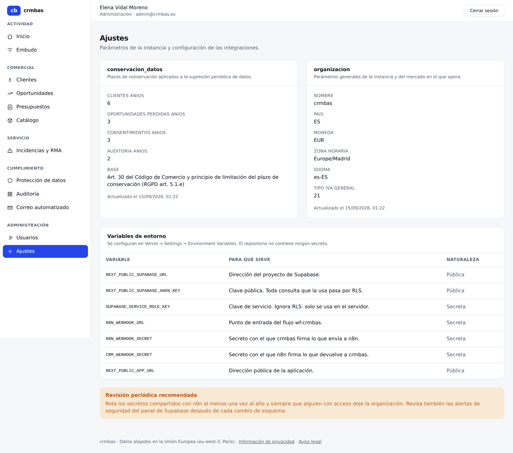

Los parámetros de la instancia —país, moneda, zona horaria, tipo de IVA general—
y los **plazos de conservación** de datos, que son la aplicación práctica del
principio de limitación del plazo de conservación del RGPD.

Debajo, el inventario de variables de entorno con las que la aplicación se
conecta a Supabase y a n8n, indicando cuáles son públicas y cuáles secretas.
Ninguna se guarda en el código: todas viven en la configuración del despliegue.

---

## 14. Páginas públicas

Dos páginas accesibles sin iniciar sesión, porque la ley exige que lo sean.

| Información de privacidad | Aviso legal |
|---|---|
| 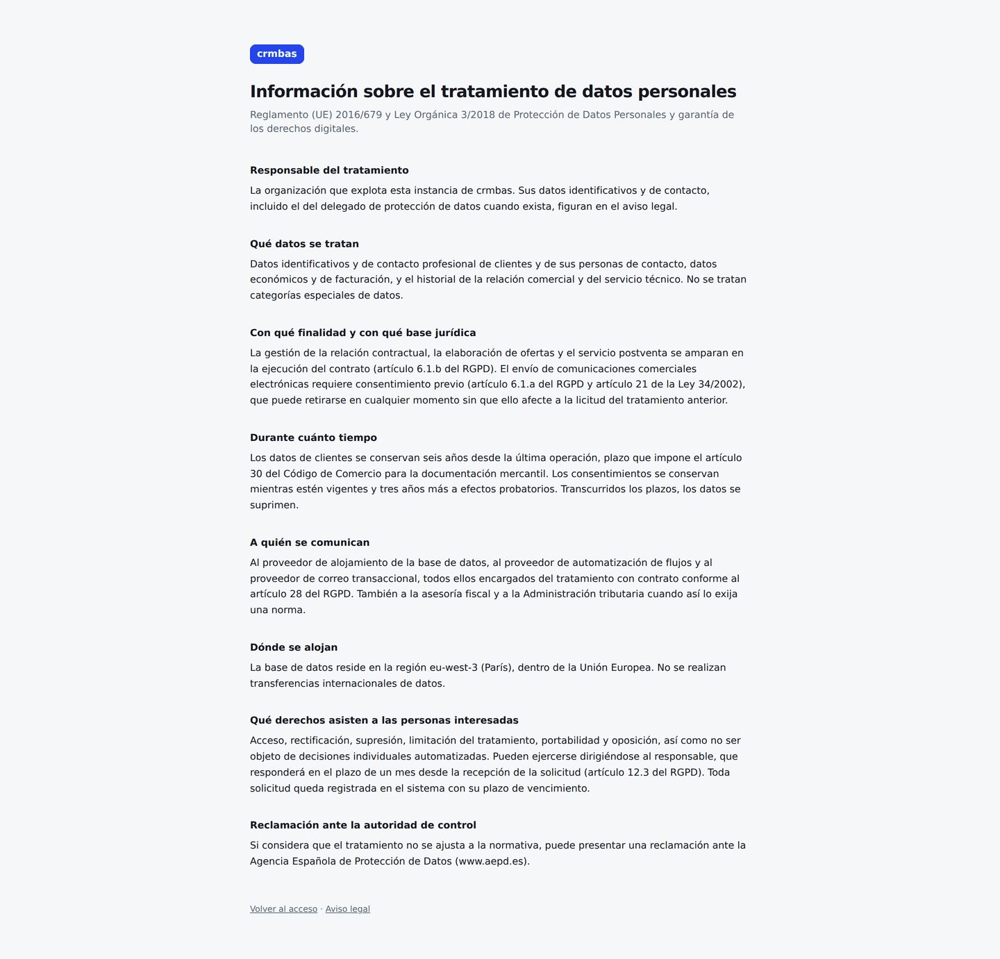 | 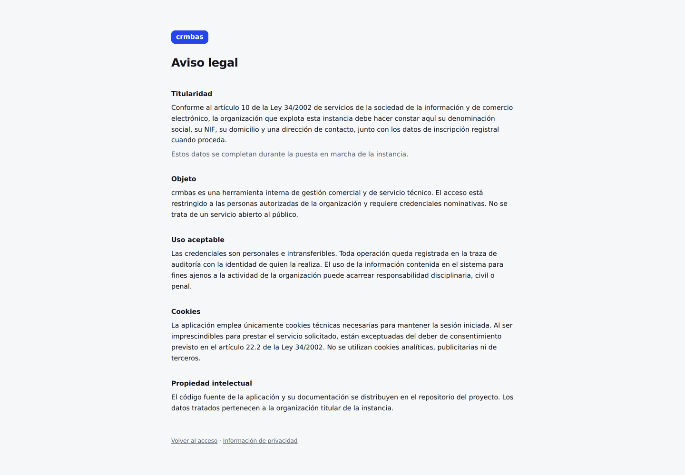 |

La primera cubre la información del artículo 13 del RGPD; la segunda, la del
artículo 10 de la Ley 34/2002. Los datos identificativos de la organización se
completan al poner la instancia en marcha.

---

## 15. En el móvil y en tema oscuro

| Tema oscuro | Móvil |
|---|---|
| 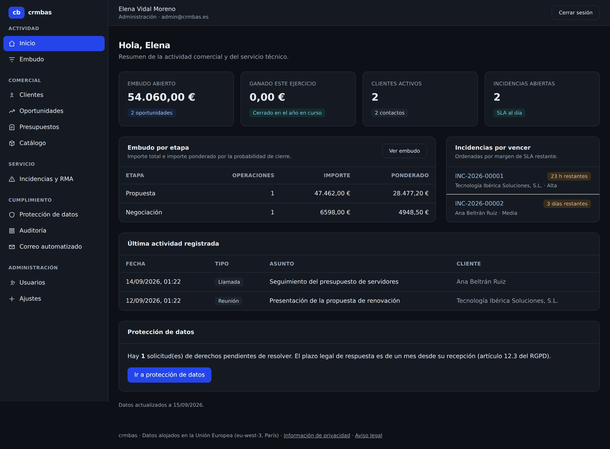 | 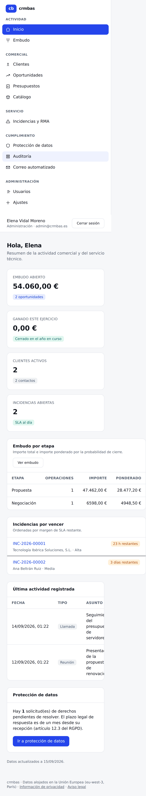 |

La aplicación sigue la preferencia de tema del sistema y se adapta a pantallas
pequeñas, de modo que se puede consultar una ficha o registrar una llamada desde
casa del cliente.

---

## 16. Preguntas frecuentes

**No me deja guardar un cliente y dice que el NIF no es válido.**
El documento no supera su letra de control. Compruébalo: es la letra que se
calcula a partir de las cifras. Si el cliente es extranjero sin NIE, de momento
hay que registrarlo con un identificador español válido.

**He puesto recargo de equivalencia y no me deja.**
El recargo de equivalencia es un régimen de comerciantes minoristas personas
físicas. Si el cliente está dado de alta como empresa, cambia primero el tipo de
cliente a autónomo o particular.

**He emitido un presupuesto con un error.**
Un presupuesto emitido no se modifica: es la oferta que se comunicó al cliente.
Márcalo como rechazado y emite uno nuevo. El histórico queda íntegro, que es
justamente lo que se pretende.

**Un cliente dice que no ha recibido un correo.**
Mira en *Correo automatizado*. Si figura como enviado, el identificador del
proveedor permite rastrearlo. Si figura como pendiente o con error, ahí verás el
motivo.

**¿Por qué no puedo ver la auditoría?**
Solo administración puede consultarla.

**Una persona nos pide que borremos sus datos.**
Regístralo en *Protección de datos* como solicitud de supresión. El sistema
calcula el plazo y envía el acuse de recibo. Ten en cuenta que la supresión no
siempre procede: la documentación mercantil debe conservarse seis años por el
artículo 30 del Código de Comercio, y eso hay que motivarlo en la respuesta.

**Alguien ha dejado la empresa.**
Desactiva su acceso en *Usuarios*. No borres la cuenta: su rastro en la
auditoría y la autoría de las actividades que registró deben conservarse.
